# Tiny Launcher (Android TV)

I built this launcher entirely on an **iPhone 13 Pro Max using the iSH terminal and GitHub**.

I originally made it just for myself because I couldn't find a lightweight launcher that had a proper, customizable weather widget that could work with custom APIs. I am sharing it here on GitHub for anyone who wants to try it out.

This launcher was tested on a **Xiaomi Mi Box S (Gen 3)** connected to a **Samsung 55" 4K UHD TV** (with an iPhone for web setup), but it should work on any Android TV device.

**Download:** Grab the latest APK from **[Releases](../../releases/latest)**.

---

## ⚡ Key Stats
* **APK Size:** Only **~0.28 MB**
* **CPU:** **0.0%** at idle
* **RAM:** **~50 MB** when wallpaper resolution is set to 2K (saving ~100 MB over standard 4K setups)

---

## 🌟 Features

### 🎛️ Tiles & Custom Banners
* **Projectivy Icon Pack Import:** Download and apply over 800+ banners directly from the launcher.
* **Custom Banner Replacement:** Replace any tile's graphic with your own custom image from storage.
* **Dynamic Accent Colors:** Tile backgrounds automatically extract and adapt to the dominant color of your current wallpaper (or pick a fixed static color).
* **Tile Tuning:** Adjust tile size, vertical row position, corner radius (from square to fully rounded), text size, and text position.
### 🌤️ Weather Widget & iPhone Web Setup
* **Multiple Weather Sources:** Works with town/city name search, free weather providers (Open-Meteo), or your own **Shelly Cloud API** if you use external smart home sensors.
* **iPhone Web Setup (Zero Remote Typing):** Scan the on-screen QR code with your iPhone to open Safari and paste your API keys directly into the TV.
* **Customizable Placement:** Resize and reposition the weather widget anywhere on your screen.

### 🛡️ Parental Control
* **Simple D-Pad Passcodes:** Set quick arrow-key passcode combinations (e.g. `► ► ◄`, `▲ ▲ ◄`) directly with your remote control.
* **Child-Proof Settings:** Keeps little ones from opening settings or messing with your launcher setup. Tested and verified against my 2, 4, and 6-year-olds.

### ⏱️ Clock & Date Customization
* Adjust the size, horizontal position, vertical position, and display mode (Full, Time Only, or Off).

### 🖼️ Wallpaper & Slideshow Engine
* **Resolution Control:** Choose between **4K ARGB8888** or **2K ARGB8888** to keep memory usage under ~50 MB.
* **Fast-Forward at Boot:** Enable "Change each restart" to fast-forward 10 wallpapers every boot so you always get fresh art on screen.

### 🎨 Clean UI
* Minimalist layout built to match the clean geometry of Google Material 3.

---

There are more small features and tweaks inside the launcher—feel free to explore and discover them yourself. I don't really enjoy typing documentation apart from code.

Enjoy!

---

## 📸 Screenshots

  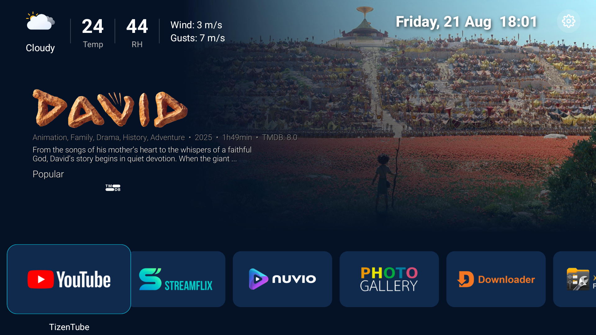
  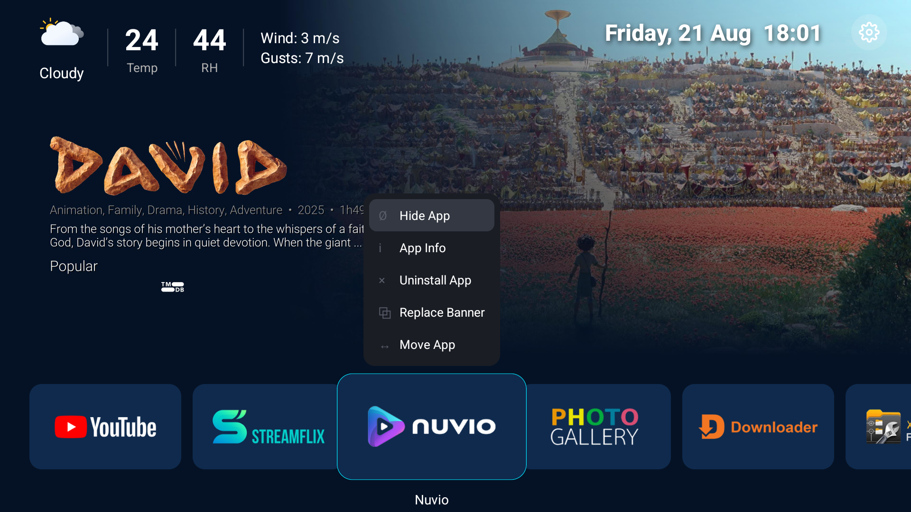
  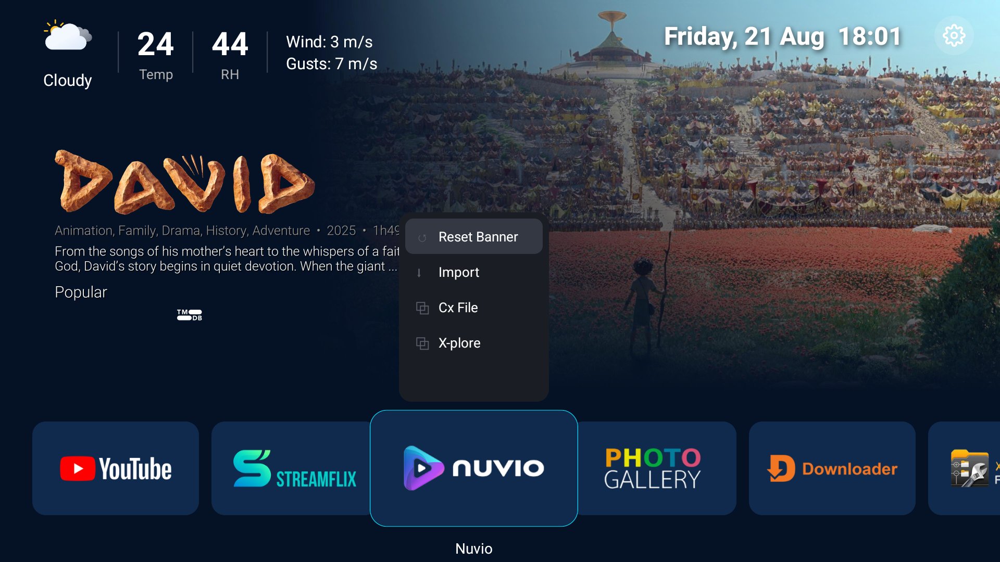
  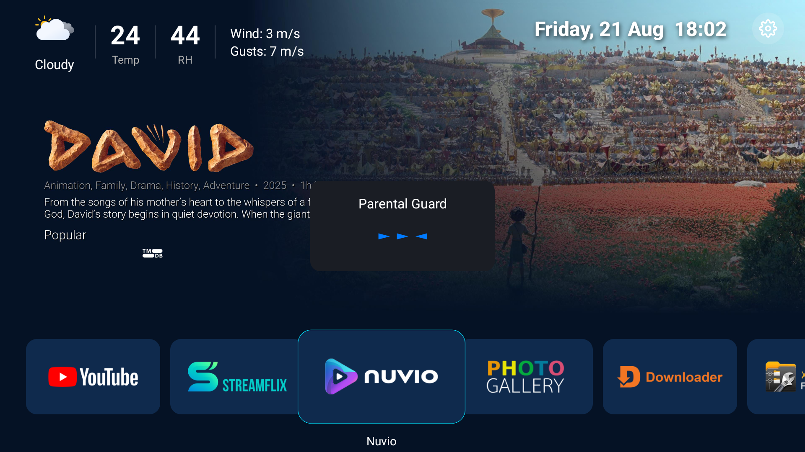
  
  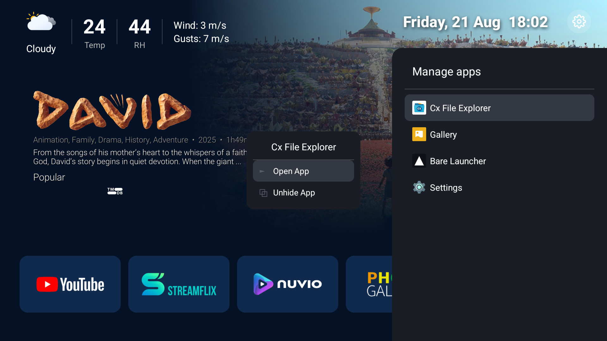
  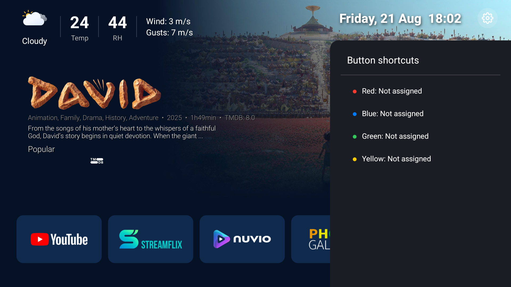
  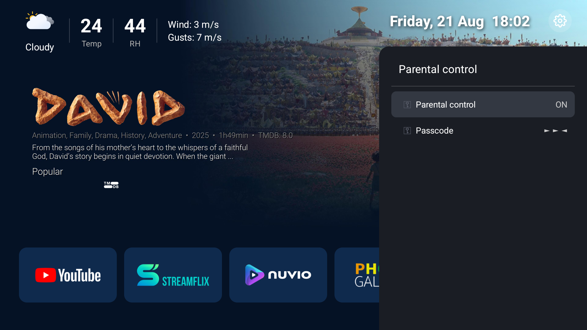
  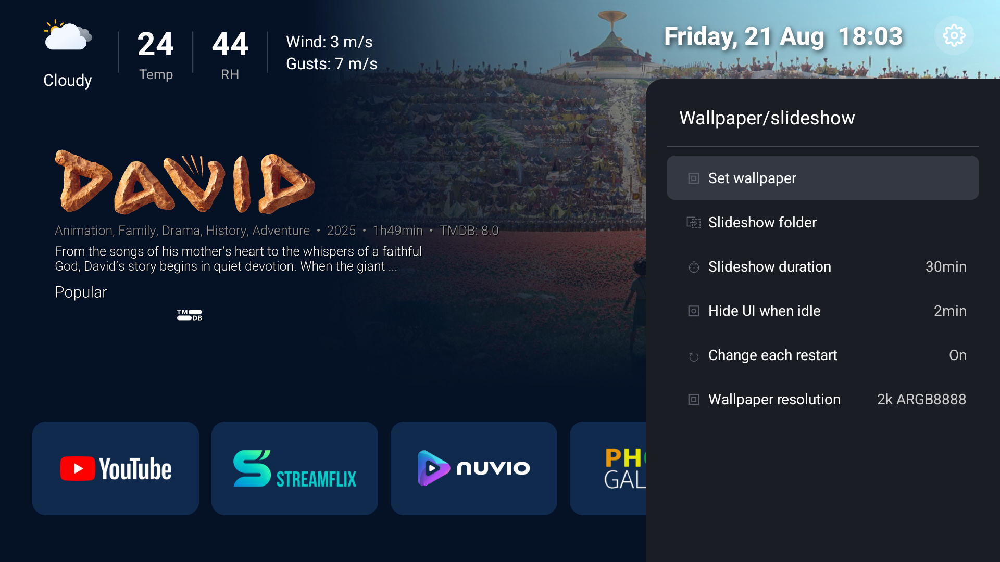
  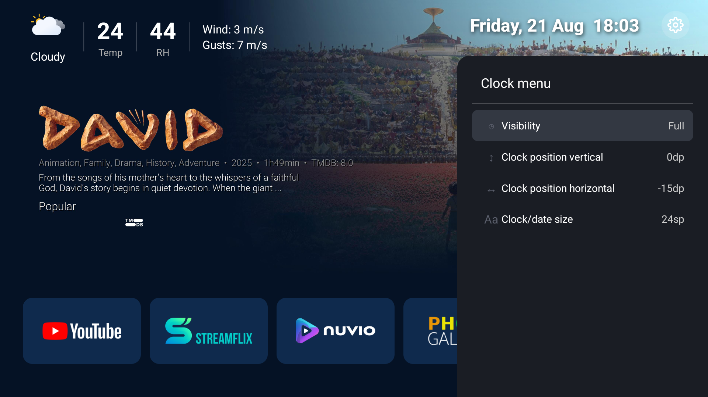
  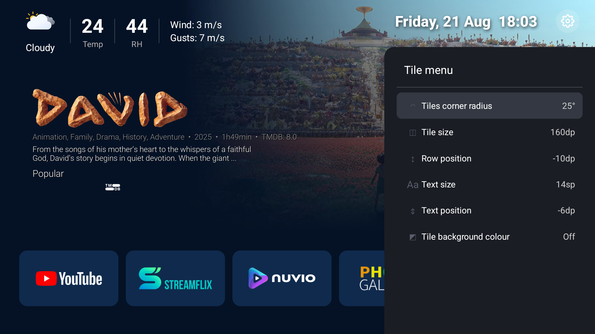
  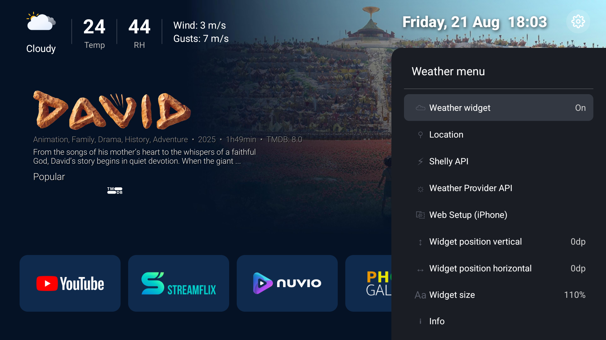

